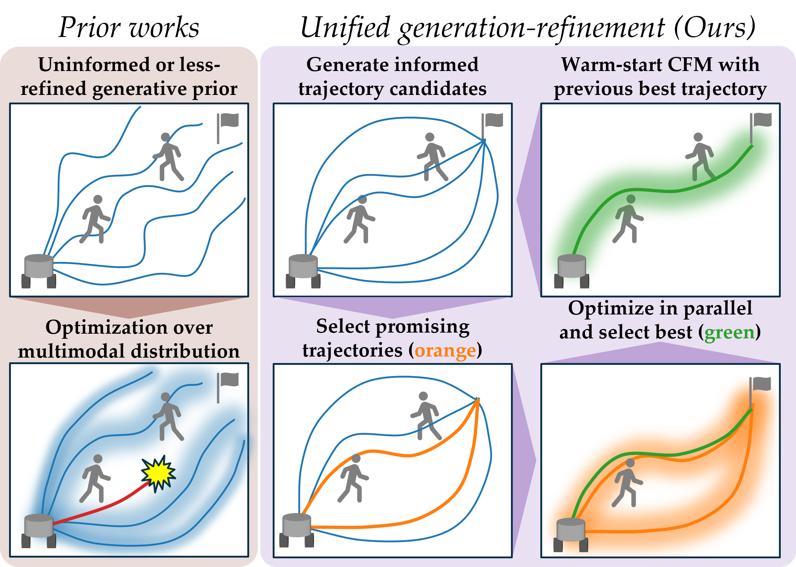

<div align="center">

## **Unified Generation-Refinement Planning: Bridging Guided Flow Matching and Sampling-Based MPC for Social Navigation**

[](https://cfm-mppi.github.io/)
[](https://arxiv.org/abs/2508.01192)

**[Kazuki Mizuta](https://m-kazuki.github.io/)**<sup>1</sup> · **[Karen Leung](https://faculty.washington.edu/kymleung/)**<sup>1,2</sup>

<sup>1</sup>University of Washington &nbsp;&nbsp;&nbsp; <sup>2</sup>NVIDIA



</div>

---

## Installation

To set up the environment, run the following commands:

```bash
conda env create -f conda_environment.yaml
conda activate cfm_mppi
pip install -e . 
```

## Usage

### Training
To train the CFM (Conditional Flow Matching) model, run:

```bash
python cfm_mppi/train.py
```

### Demos
We provide Jupyter notebook demos for different dynamics models:
- **Unicycle dynamics:** [`cfm_mppi/example/unicycle.ipynb`](cfm_mppi/example/unicycle.ipynb)
- **Double integrator dynamics:** [`cfm_mppi/example/doubleintegrator.ipynb`](cfm_mppi/example/doubleintegrator.ipynb)

## Pre-trained Models and Datasets

For quick evaluation, download the pre-trained weights and datasets from [Google Drive](https://drive.google.com/drive/folders/1gggsHGnLyh_rsaEw91EaqIO8I4Asqh64?usp=sharing) and organize them into the following directory structure:

- `dataset/` &rarr; `./dataset/`
- `checkpoint.pt` &rarr; `./output_dir/cfm_transformer/checkpoint.pth`
- `args.json` &rarr; `./output_dir/cfm_transformer/args.json`

## Citation

If you find our work useful in your research, please consider citing:

```bibtex
@inproceedings{MizutaLeung2026,
  title = {Unified Generation-Refinement Planning: Bridging Guided Flow Matching and Sampling-Based MPC for Social Navigation},
  author = {Kazuki Mizuta and Karen Leung},
  booktitle = {Proc.\ IEEE Conf.\ on Robotics and Automation},
  year = {2026},
}
```

## Acknowledgements

This repository is built upon several excellent open-source projects:
- [flow_matching](https://github.com/facebookresearch/flow_matching)
- [latent-diffusion](https://github.com/CompVis/latent-diffusion/tree/main)
- [diffuser](https://github.com/jannerm/diffuser/tree/maze2d)
- [trajdata](https://github.com/NVlabs/trajdata/tree/main)
- [mppi_playground](https://github.com/kohonda/mppi_playground)
